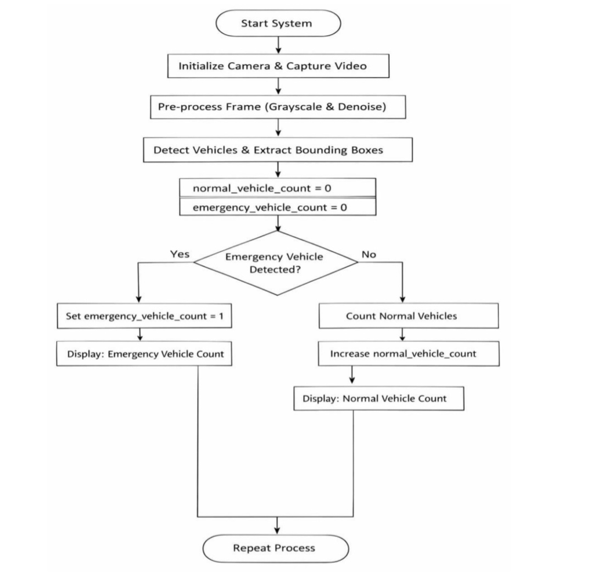
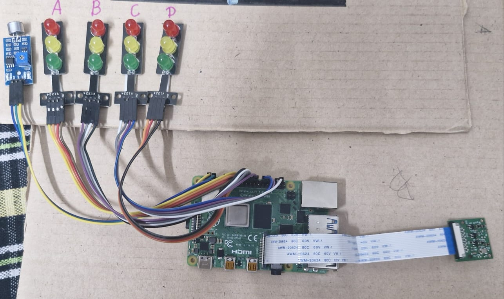
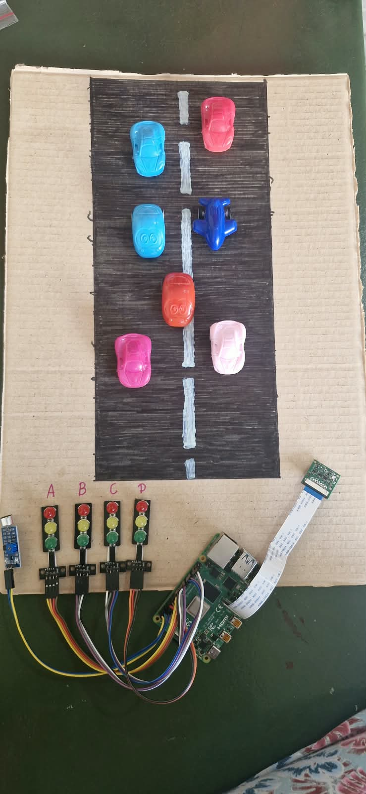
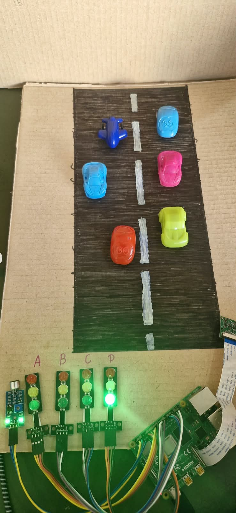

# Camera-Based Traffic Congestion Control with Emergency Vehicle Priority

A Raspberry Pi-based intelligent traffic management system that uses camera-based image processing to estimate traffic density across four lanes and dynamically control traffic signals. The system also provides priority clearance for emergency vehicles by overriding normal traffic signal operation.

## Project Overview

Traffic congestion at road junctions can lead to increased waiting time and inefficient traffic flow. This project uses a Raspberry Pi, camera, OpenCV-based image processing, and traffic signal LEDs to monitor traffic conditions and control signals based on lane-wise traffic density.

The system also includes an emergency vehicle detection mechanism. When an emergency vehicle is detected, the normal traffic control sequence is overridden and priority is given to facilitate faster movement of the emergency vehicle.

## Key Features

- Camera-based traffic monitoring
- Traffic density estimation using image processing
- Four-lane traffic signal control
- Dynamic lane prioritization based on traffic density
- Emergency vehicle detection
- Emergency signal override
- Raspberry Pi GPIO-based signal control
- Continuous monitoring and control

## Hardware Components

- Raspberry Pi
- Camera module / USB camera
- Traffic signal LED modules
- Emergency vehicle detection sensor/switch
- Jumper wires
- Power supply
- Miniature road model with vehicles

## Technologies Used

- Python
- OpenCV
- Raspberry Pi
- GPIO
- Computer Vision
- Image Processing

## Working Principle

The system operates in two main conditions:

### Normal Traffic Condition

1. The camera captures traffic information from the lanes.
2. The captured image is pre-processed using grayscale conversion and noise reduction.
3. Vehicles are detected using image-processing techniques.
4. Traffic density is estimated using contour area.
5. The lanes are arranged according to their estimated traffic density.
6. The lane with higher traffic density receives higher signal priority.
7. Traffic signals are controlled through Raspberry Pi GPIO pins.

### Emergency Vehicle Condition

When an emergency vehicle is detected:

1. The normal traffic control operation is interrupted.
2. The emergency condition is activated.
3. Traffic signals are controlled to provide priority clearance.
4. The designated lane receives GREEN signal.
5. Normal traffic control resumes after the emergency condition.

## Traffic Density Estimation

The system processes the captured traffic images using OpenCV.

The image-processing steps include:

- Grayscale conversion
- Noise reduction using Gaussian blur
- Morphological processing
- Thresholding
- Contour detection

The contour area is used as an estimate of traffic density.

Higher contour area indicates higher estimated traffic density.

### Example Test Result

| Lane | Density Value |
|------|--------------:|
| A | 32118.0 |
| B | 26498.5 |
| C | 15078.0 |
| D | 38267.5 |

For this test case, the priority order was:

**D → A → B → C**

## Traffic Signal Control

Each lane has three signal LEDs:

- RED
- YELLOW
- GREEN

The signal sequence follows:

**GREEN → YELLOW → RED**

The Raspberry Pi controls the LEDs through its GPIO pins.

## Emergency Vehicle Priority

The system includes an emergency detection input connected to the Raspberry Pi.

When an emergency condition is detected, the system overrides normal traffic operation and provides priority clearance for the emergency vehicle.

This feature is intended to reduce waiting time for emergency vehicles at the junction.

## System Flowchart

## Hardware Prototype

### Raspberry Pi and Traffic Signal Setup

### Four-Lane Traffic Model

### Traffic Signal Testing

## GPIO Configuration

| Lane | Red | Yellow | Green |
|------|-----|--------|-------|
| A | GPIO 18 | GPIO 23 | GPIO 24 |
| B | GPIO 25 | GPIO 8 | GPIO 7 |
| C | GPIO 12 | GPIO 16 | GPIO 20 |
| D | GPIO 17 | GPIO 27 | GPIO 22 |

Emergency detection input:

**GPIO 4**

## Project Outcome

The developed prototype demonstrates camera-based traffic monitoring, dynamic traffic signal prioritization, and emergency vehicle priority using a Raspberry Pi-based control system.
